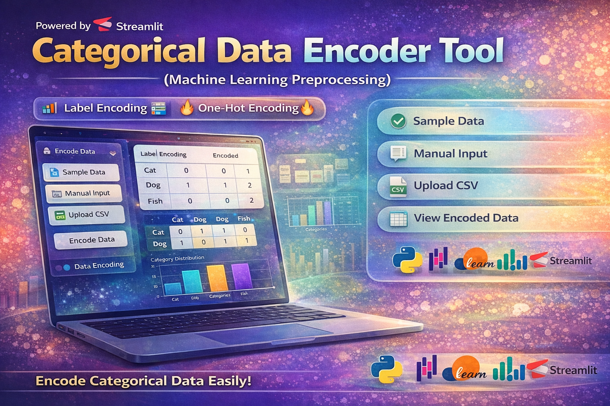

<p align="center">
  
</p>

---

# 🚀 Categorical Data Encoder Tool (Machine Learning Preprocessing)

A powerful and interactive **Streamlit web application** that demonstrates how to perform **Label Encoding** and **One-Hot Encoding** on categorical data.

This project is designed to help beginners and developers understand **data preprocessing techniques** used in Machine Learning.

---

## 📌 Features

* 🔢 **Label Encoding**

  * Converts categorical values into numerical labels
* 🔥 **One-Hot Encoding**

  * Converts categories into binary vectors
* 📂 **Multiple Input Methods**

  * Default sample data
  * Manual input (comma-separated values)
  * Upload CSV dataset
* 📊 **Data Visualization**

  * Bar chart for category distribution
* 🎯 **User-Friendly UI**

  * Built with Streamlit for interactive experience

---

## 🧠 Why This Project?

Data preprocessing is a **critical step in Machine Learning**.
This project helps you understand:

* Difference between Label Encoding & One-Hot Encoding
* When to use each encoding technique
* How categorical data is transformed for ML models

---

## 🛠️ Tech Stack

* Python 🐍
* Streamlit 🎨
* Pandas 📊
* NumPy 🔢
* Scikit-learn 🤖
* Matplotlib 📈

---

## 📂 Project Structure

```
📁 Encoder-Tool/
│── app.py
│── requirements.txt
│── README.md
```

---

## ▶️ How to Run the Project

### 1️⃣ Clone the Repository

```
git clone https://github.com/selvan-01/Encoders-in-Machine-Learning.git
cd encoder-tool
```

### 2️⃣ Install Dependencies

```
pip install -r requirements.txt
```

### 3️⃣ Run the App

```
streamlit run app.py
```

---

## 📸 Output Preview

* Label Encoding Table
* One-Hot Encoding Table
* Category Distribution Graph

---

## ⚠️ Important Notes

* Label Encoding assigns numerical values (may create ordinal relationship)
* One-Hot Encoding avoids ranking between categories
* New versions of Scikit-learn use:

  ```
  OneHotEncoder(sparse_output=False)
  ```

---

## 🚀 Future Improvements

* 📥 Download encoded data as CSV
* 🎨 Advanced UI design (themes & animations)
* 📊 Interactive charts using Plotly
* 🤖 Integration with ML models

---

## 👨‍💻 Author

**S. Senthamil Selvan (Sen)**
🎯 Aspiring Ai Developer | AI & ML Enthusiast

## 🔗 Links

- 💼 [LinkedIn](https://www.linkedin.com/in/senthamil45)
- 🌍 [Portfolio](https://senthamill.vercel.app/)
- 💻 [GitHub](https://github.com/selvan-01/Encoders-in-Machine-Learning.git)


---

## ⭐ Support

If you found this project useful:

* ⭐ Star this repository
* 🔁 Share with others
* 💬 Give feedback

---

## 💡 Conclusion

This project provides a **hands-on understanding of encoding techniques**, making it a great addition to your **Machine Learning portfolio**.

---
